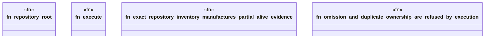

# `crates/ggen-engine/tests/ci_g0_inventory_e2e.rs`

Source SHA-256: `d56a64d8397242e6879a1bfa3c444a8f6f143d405167fa3bb7f5567e7228b9fd`

## Dependencies

- `std::fs`
- `std::path::{Path, PathBuf}`
- `std::process::{Command, Output}`

## Standing

- Structural parse: `ALIVE`
- Runtime behavior: `UNKNOWN`
