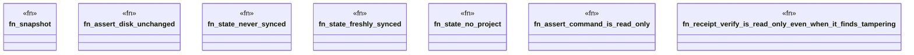

# `crates/ggen-engine/tests/cli_read_only_invariant_matrix.rs`

Source SHA-256: `81f80135271cc83e1fd1a4fc84588a28315474229809f184abb6ebec11fb1a40`

## Dependencies

- `chicago_tdd_tools::cli_proof::CliHarness`
- `std::collections::BTreeMap`
- `std::path::{Path, PathBuf}`
- `std::time::SystemTime`
- `tempfile::TempDir`

## Standing

- Structural parse: `ALIVE`
- Runtime behavior: `UNKNOWN`
