# `crates/ggen-engine/tests/combinatorial_matrix.rs`

Source SHA-256: `75207c3ba0b82321b8aff6b447377fcf0f9939b3833ae19711ab3f0fb97d43c9`

```mermaid
classDiagram
    class enum_TargetState {
      <<enum>>
    }
    class enum_SkipIf {
      <<enum>>
    }
    class enum_Anchor {
      <<enum>>
    }
    class enum_Expected {
      <<enum>>
    }
    class fn_reference_model {
      <<fn>>
    }
    class fn_classify {
      <<fn>>
    }
    class fn_frontmatter_for {
      <<fn>>
    }
    class fn_exhaustive_write_decision_matrix {
      <<fn>>
    }
    class fn_write_project {
      <<fn>>
    }
    class fn_read_receipt_payload_bytes {
      <<fn>>
    }
    class fn_every_closed_vocabulary_key_parses {
      <<fn>>
    }
    class fn_unknown_keys_fail_with_fm_tpl_002_naming_the_key {
      <<fn>>
    }
    class fn_when_sparql_skip_empty_cross {
      <<fn>>
    }
```

## Dependencies

- `ggen_engine::{ graph::{Delta, DeterministicGraph}, sync::{sync, SyncOptions, SyncReceipt, RECEIPT_REL_PATH}, template::{Frontmatter, MatchSpec, Template}, write::{plan_write, WriteOutcome}, }`
- `proptest::prelude::*`
- `std::{collections::BTreeMap, path::Path}`
- `tempfile::TempDir`

## Standing

- Structural parse: `ALIVE`
- Runtime behavior: `UNKNOWN`
