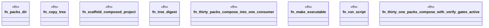

# `crates/ggen-engine/tests/composed_packs_e2e.rs`

Source SHA-256: `d50e984e6afbbc7beb18fca0008a500a81ec2fd721c039a1585b2353fa27f99f`

## Dependencies

- `chicago_tdd_tools::cli_proof::CliHarness`
- `std::os::unix::fs::PermissionsExt`
- `std::path::{Path, PathBuf}`
- `std::process::Command`
- `tempfile::TempDir`

## Standing

- Structural parse: `ALIVE`
- Runtime behavior: `UNKNOWN`
