# `crates/ggen-engine/tests/config_schema_dispatch_e2e.rs`

Source SHA-256: `4934f7395cace1915018d211283c19dbdb4f0047dddd63183d261738b147b18f`

```mermaid
classDiagram
    class fn_write {
      <<fn>>
    }
    class fn_authoritative_schema_valid_sync_is_accepted {
      <<fn>>
    }
    class fn_compatible_schema_valid_sync_is_accepted {
      <<fn>>
    }
    class fn_unsupported_schema_sync_is_typed_refusal {
      <<fn>>
    }
    class fn_ambiguous_schema_sync_is_typed_refusal {
      <<fn>>
    }
    class fn_malformed_toml_sync_is_typed_parse_failure {
      <<fn>>
    }
    class fn_missing_required_field_is_field_specific_typed_error {
      <<fn>>
    }
    class fn_unknown_field_is_rejected_under_strict_parsing {
      <<fn>>
    }
    class fn_doctor_succeeds_with_correct_diagnostic_on_each_supported_schema {
      <<fn>>
    }
```

## Dependencies

- `ggen_engine::sync::{sync, SyncOptions}`
- `std::path::Path`
- `tempfile::TempDir`

## Standing

- Structural parse: `ALIVE`
- Runtime behavior: `UNKNOWN`
