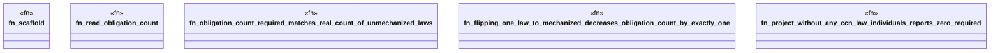

# `crates/ggen-engine/tests/constitution_obligation_e2e.rs`

Source SHA-256: `784b61f754bee603092b186d09b69c8dfc0a9595e41480ec9821575387b5d42f`

## Dependencies

- `ggen_engine::sync::{sync, SyncOptions, SyncReceipt, RECEIPT_REL_PATH}`
- `praxis_core::receipt_epoch::{read_receipt_epoch, ObligationCount}`
- `std::path::Path`

## Standing

- Structural parse: `ALIVE`
- Runtime behavior: `UNKNOWN`
