# `crates/ggen-engine/tests/cross_pack_matrix.rs`

Source SHA-256: `46c99de6f9e203fb317b1e90497cf423efb38f659465659603e14d74e74a8af4`

```mermaid
classDiagram
    class fn_packs_dir {
      <<fn>>
    }
    class fn_copy_tree {
      <<fn>>
    }
    class fn_scaffold_multi_pack_project {
      <<fn>>
    }
    class fn_read_receipt {
      <<fn>>
    }
    class fn_all_eight_framework_packs_exist_on_disk {
      <<fn>>
    }
    class fn_mega_project_all_packs_sync {
      <<fn>>
    }
    class fn_pairwise_pack_matrix_syncs {
      <<fn>>
    }
    class fn_ontology_union_and_declaration_order_are_canonical {
      <<fn>>
    }
    class fn_declaration_order_exclusion_does_not_mask_a_genuine_pack_set_difference {
      <<fn>>
    }
    class fn_corrupting_one_pack_post_lock_fails_closed_naming_only_that_pack {
      <<fn>>
    }
    class fn_wasm4pm_algorithms_and_cognition_packs_full_coverage {
      <<fn>>
    }
```

## Dependencies

- `chicago_tdd_tools::cli_proof::CliHarness`
- `ggen_engine::sync::{sync, SyncOptions, SyncReceipt, RECEIPT_REL_PATH}`
- `std::path::{Path, PathBuf}`
- `tempfile::TempDir`

## Standing

- Structural parse: `ALIVE`
- Runtime behavior: `UNKNOWN`
