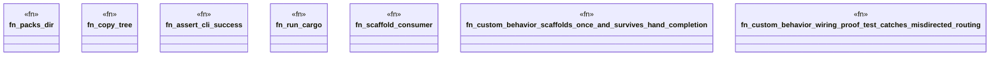

# `crates/ggen-engine/tests/custom_behavior_e2e.rs`

Source SHA-256: `d795f9a438e58ec9a9fa18c352d4e8feb7ba0c1f7442e443983fe5092c0fe339`

## Dependencies

- `chicago_tdd_tools::cli_proof::CliHarness`
- `std::path::{Path, PathBuf}`
- `std::process::Command`
- `tempfile::TempDir`

## Standing

- Structural parse: `ALIVE`
- Runtime behavior: `UNKNOWN`
