# `crates/ggen-engine/tests/datatype_coercion_e2e.rs`

Source SHA-256: `333b51380bc46e26574f2b542d09698ca2c8164e68759f1ef2ac0acebb7dc896`

```mermaid
classDiagram
    class fn_scaffold {
      <<fn>>
    }
    class fn_write_template {
      <<fn>>
    }
    class fn_run_sync {
      <<fn>>
    }
    class fn_xsd_integer_renders_through_arithmetic_proving_it_is_a_real_number {
      <<fn>>
    }
    class fn_xsd_boolean_gates_if_else_correctly_for_both_true_and_false {
      <<fn>>
    }
    class fn_xsd_decimal_renders_through_multiplication_proving_it_is_a_real_number {
      <<fn>>
    }
    class fn_malformed_integer_literal_falls_back_to_string_without_crashing_sync {
      <<fn>>
    }
    class fn_untyped_plain_string_literal_still_renders_as_before {
      <<fn>>
    }
```

## Dependencies

- `ggen_engine::sync::{sync, SyncOptions}`
- `std::path::Path`
- `tempfile::TempDir`

## Standing

- Structural parse: `ALIVE`
- Runtime behavior: `UNKNOWN`
