# `crates/ggen-engine/tests/determinism_query_reexecution_e2e.rs`

Source SHA-256: `3d0d44d49dbcff275c99ea336c4beea21820ebf11310f3789406d863d0b9ed52`

```mermaid
classDiagram
    class fn_scaffold {
      <<fn>>
    }
    class fn_write_template {
      <<fn>>
    }
    class struct_PhaseCounts {
      <<struct>>
      +"primary: usize"
      +"determinism_recheck: usize"
      +"unrecognized: usize"
    }
    class struct_PhaseVisitor {
      <<struct>>
      +"phase: Option~String~"
    }
    class struct_PhaseCountingSubscriber {
      <<struct>>
      +"counts: Arc~Mutex~PhaseCounts~~"
    }
    class fn_run_sync_counting_phases {
      <<fn>>
    }
    class fn_determinism_true_reexecutes_the_named_sparql_query_a_second_time {
      <<fn>>
    }
    class fn_determinism_absent_never_triggers_a_second_query_execution {
      <<fn>>
    }
    class fn_determinism_explicitly_false_never_triggers_a_second_query_execution {
      <<fn>>
    }
    class fn_determinism_true_reexecutes_once_per_template_not_once_per_row {
      <<fn>>
    }
    note "Subscriber for PhaseCountingSubscriber"
    note "Visit for PhaseVisitor"
```

## Dependencies

- `ggen_engine::sync::{sync, SyncOptions}`
- `std::{ path::Path, sync::{Arc, Mutex}, }`
- `tempfile::TempDir`
- `tracing::{ field::{Field, Visit}, span::{Attributes, Id, Record}, Event, Metadata, Subscriber, }`

## Standing

- Structural parse: `ALIVE`
- Runtime behavior: `UNKNOWN`
