# `crates/ggen-engine/tests/doctor_e2e.rs`

Source SHA-256: `30e4ce52321064127e5f47a5f0e508eb1a4abe442e7cdb601aafb5146ec89943`

```mermaid
classDiagram
    class fn_scaffold {
      <<fn>>
    }
    class fn_write_ontology {
      <<fn>>
    }
    class fn_examples_dir {
      <<fn>>
    }
    class fn_copy_tree {
      <<fn>>
    }
    class fn_scaffold_with_pack {
      <<fn>>
    }
    class fn_run_doctor {
      <<fn>>
    }
    class fn_stdout_json {
      <<fn>>
    }
    class fn_stderr_str {
      <<fn>>
    }
    class fn_clean_synced_project_is_healthy {
      <<fn>>
    }
    class fn_never_synced_project_is_healthy_by_definition {
      <<fn>>
    }
    class fn_corrupted_pack_content_fails_lockfile_drift {
      <<fn>>
    }
    class fn_deleted_output_fails_receipt_staleness_independently_of_other_checks {
      <<fn>>
    }
    class fn_orphaned_artifact_after_template_deletion_fails_independently {
      <<fn>>
    }
```

## Dependencies

- `ggen_engine::sync::{sync, SyncOptions}`
- `std::path::{Path, PathBuf}`
- `tempfile::TempDir`

## Standing

- Structural parse: `ALIVE`
- Runtime behavior: `UNKNOWN`
