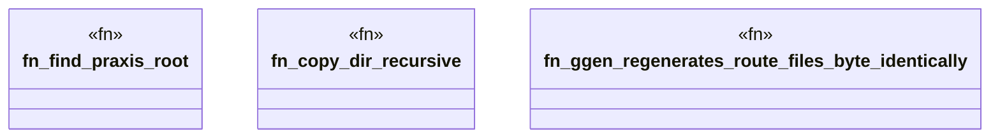

# `crates/ggen-engine/tests/dogfood_regression.rs`

Source SHA-256: `08a680a505b0b8b0be106f69c00d301d506613a35e47384f1731c2e86023e8c2`

## Dependencies

- `chicago_tdd_tools::cli_proof::CliHarness`
- `std::path::{Path, PathBuf}`

## Standing

- Structural parse: `ALIVE`
- Runtime behavior: `UNKNOWN`
