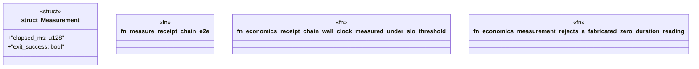

# `crates/ggen-engine/tests/economics_measured_evidence_test.rs`

Source SHA-256: `6785e4a2ee61c484afc5027a791b54c3ff2b31d39e108f8dcf7839aa41041f2d`

## Dependencies

- `std::path::Path`
- `std::process::Command`
- `std::sync::OnceLock`
- `std::time::Instant`

## Standing

- Structural parse: `ALIVE`
- Runtime behavior: `UNKNOWN`
