# `crates/ggen-engine/tests/framework_packs_e2e.rs`

Source SHA-256: `829bcb581e50d9e91eee15c18f774b9c347813679667af19f64ce857d034947b`

```mermaid
classDiagram
    class fn_packs_dir {
      <<fn>>
    }
    class fn_copy_tree {
      <<fn>>
    }
    class fn_scaffold_pack_project {
      <<fn>>
    }
    class fn_wasm4pm_compat_pack_syncs {
      <<fn>>
    }
    class fn_lsp_max_pack_syncs {
      <<fn>>
    }
    class fn_star_toml_pack_syncs {
      <<fn>>
    }
    class fn_chicago_tdd_tools_pack_syncs {
      <<fn>>
    }
    class fn_clap_noun_verb_pack_syncs {
      <<fn>>
    }
    class fn_praxis_core_pack_syncs {
      <<fn>>
    }
    class fn_wasm4pm_cognition_pack_syncs {
      <<fn>>
    }
    class fn_wasm4pm_algorithms_pack_syncs {
      <<fn>>
    }
    class fn_write_synthetic_pack {
      <<fn>>
    }
    class fn_scaffold_synthetic_consumer {
      <<fn>>
    }
    class fn_pack_gate_refuses_a_violating_union_graph {
      <<fn>>
    }
    class fn_legacy_pack_shapes_ttl_is_refused_loudly {
      <<fn>>
    }
    class fn_aggregate_modules_emits_one_engine_owned_aggregator {
      <<fn>>
    }
    class fn_aggregate_modules_off_by_default_emits_no_aggregator {
      <<fn>>
    }
```

## Dependencies

- `chicago_tdd_tools::cli_proof::CliHarness`
- `std::path::{Path, PathBuf}`
- `tempfile::TempDir`

## Standing

- Structural parse: `ALIVE`
- Runtime behavior: `UNKNOWN`
