# `crates/ggen-engine/tests/frontmatter_cardinality_e2e.rs`

Source SHA-256: `dc7defd64c058e4d0d5209b8c3cde197c32ae99e6c0afa44e70b5ff0f58496e4`

```mermaid
classDiagram
    class fn_scaffold {
      <<fn>>
    }
    class fn_template {
      <<fn>>
    }
    class fn_run {
      <<fn>>
    }
    class fn_explicit_driver_aggregates_static_target_in_row_order {
      <<fn>>
    }
    class fn_explicit_driver_fans_out_dynamic_targets {
      <<fn>>
    }
    class fn_missing_driver_refuses_before_hook_or_write {
      <<fn>>
    }
    class fn_scalar_driver_refuses {
      <<fn>>
    }
    class fn_static_aggregate_refuses_row_varying_lifecycle_law {
      <<fn>>
    }
```

## Dependencies

- `ggen_engine::sync::{sync, SyncOptions}`
- `std::path::Path`
- `tempfile::TempDir`

## Standing

- Structural parse: `ALIVE`
- Runtime behavior: `UNKNOWN`
