# `crates/ggen-engine/tests/frontmatter_fields_e2e.rs`

Source SHA-256: `c71b25c47a9f286a12a24ea7e014d7359000772c854132d10bac03f47da9b098`

```mermaid
classDiagram
    class fn_scaffold {
      <<fn>>
    }
    class fn_write_template {
      <<fn>>
    }
    class fn_sh_before_and_sh_after_run_around_the_write {
      <<fn>>
    }
    class fn_dangerous_sh_command_is_refused {
      <<fn>>
    }
    class fn_dry_run_never_executes_shell_hooks {
      <<fn>>
    }
    class fn_backup_copies_existing_file_before_force_overwrite {
      <<fn>>
    }
    class fn_missing_shape_file_is_refused {
      <<fn>>
    }
    class fn_existing_shape_file_passes {
      <<fn>>
    }
    class fn_determinism_true_passes_for_a_pure_template {
      <<fn>>
    }
    class fn_freeze_always_skips_once_target_exists {
      <<fn>>
    }
    class fn_freeze_always_drift_is_quarantined_and_creates_an_obligation_in_the_real_receipt {
      <<fn>>
    }
    class fn_freeze_always_no_drift_stays_admitted_with_no_obligation {
      <<fn>>
    }
    class fn_freeze_checksum_allows_regen_until_manual_edit_then_protects_it {
      <<fn>>
    }
    class fn_freeze_checksum_without_slots_dir_is_refused {
      <<fn>>
    }
    class fn_from_field_loads_body_from_referenced_sibling_file {
      <<fn>>
    }
    class fn_from_field_path_traversal_outside_template_dir_is_refused {
      <<fn>>
    }
```

## Dependencies

- `ggen_engine::sync::{sync, SyncOptions, RECEIPT_REL_PATH}`
- `praxis_core::receipt_record::ReceiptRecord`
- `std::path::Path`
- `tempfile::TempDir`

## Standing

- Structural parse: `ALIVE`
- Runtime behavior: `UNKNOWN`
