# `crates/ggen-engine/tests/frontmatter_fortune5_hardening_e2e.rs`

Source SHA-256: `dbbc231e8e13b5cb0bbbb5ee4a005e0229757c0443075ae3eac6ae5c7fc28544`

```mermaid
classDiagram
    class fn_scaffold {
      <<fn>>
    }
    class fn_template {
      <<fn>>
    }
    class fn_excessive_query_rows_refuse_before_hook_or_write {
      <<fn>>
    }
    class fn_unsafe_skip_empty_target_is_admitted_before_skip {
      <<fn>>
    }
    class fn_canonical_target_aliases_are_duplicate_outputs {
      <<fn>>
    }
    class fn_shape_is_regular_safe_and_receipt_bound {
      <<fn>>
    }
    class fn_shape_directory_refuses_before_hook {
      <<fn>>
    }
    class fn_placement_without_injection_refuses_before_hook {
      <<fn>>
    }
    class fn_unreadable_checksum_state_refuses_before_hook {
      <<fn>>
    }
```

## Dependencies

- `ggen_engine::sync::{sync, SyncOptions, MAX_QUERY_RESULT_ROWS}`
- `std::path::Path`
- `tempfile::TempDir`

## Standing

- Structural parse: `ALIVE`
- Runtime behavior: `UNKNOWN`
