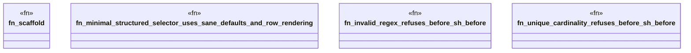

# `crates/ggen-engine/tests/frontmatter_matchers_e2e.rs`

Source SHA-256: `0388cefc87682236505853da2c633d6acd546ba8e27f37672ef66a8eb2d7ef19`

## Dependencies

- `ggen_engine::sync::{sync, SyncOptions}`
- `std::path::Path`
- `tempfile::TempDir`

## Standing

- Structural parse: `ALIVE`
- Runtime behavior: `UNKNOWN`
