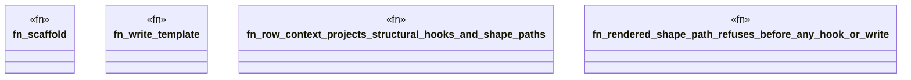

# `crates/ggen-engine/tests/frontmatter_maximalism_e2e.rs`

Source SHA-256: `40d53ca771bc0d30317a6b036c3d277a4353649b5068af22226288efbf286396`

## Dependencies

- `ggen_engine::sync::{sync, SyncOptions}`
- `std::path::Path`
- `tempfile::TempDir`

## Standing

- Structural parse: `ALIVE`
- Runtime behavior: `UNKNOWN`
