# `crates/ggen-engine/tests/frontmatter_rdf_e2e.rs`

Source SHA-256: `72b3bd9a86cb8611f074bb6fe2a1ed6c5bbe28c6655be6e152a5f5722ecc6458`

```mermaid
classDiagram
    class fn_scaffold {
      <<fn>>
    }
    class fn_write_template {
      <<fn>>
    }
    class fn_run_sync {
      <<fn>>
    }
    class fn_rdf_file_field_loads_sibling_ttl_and_layers_over_base_graph {
      <<fn>>
    }
    class fn_rdf_inline_field_is_queryable {
      <<fn>>
    }
    class fn_prefixes_and_base_expand_relative_and_prefixed_iris_in_rdf_inline {
      <<fn>>
    }
    class fn_rdf_path_traversal_escape_is_refused {
      <<fn>>
    }
    class fn_different_templates_rdf_overlays_are_isolated_from_each_other {
      <<fn>>
    }
```

## Dependencies

- `ggen_engine::sync::{sync, SyncOptions}`
- `std::path::Path`
- `tempfile::TempDir`

## Standing

- Structural parse: `ALIVE`
- Runtime behavior: `UNKNOWN`
