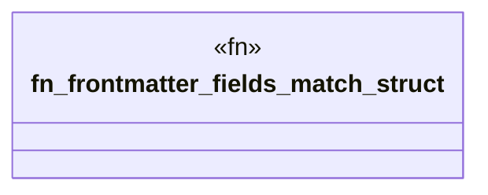

# `crates/ggen-engine/tests/frontmatter_schema_match.rs`

Source SHA-256: `5b3ad06e5b29b6ea1b9d22514ea68fb3527d77cdc7ed0cefa51aedffdd1173af`

## Dependencies

- `ggen_engine::{graph::DeterministicGraph, template::Frontmatter}`
- `oxigraph::sparql::QueryResults`
- `schemars::schema_for`
- `serde_json::Value as Json`
- `std::collections::BTreeSet`

## Standing

- Structural parse: `ALIVE`
- Runtime behavior: `UNKNOWN`
