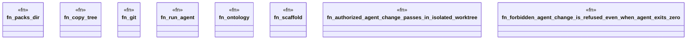

# `crates/ggen-engine/tests/gall_agent_executor_e2e.rs`

Source SHA-256: `f6e46792878f2a3d5fbe0f6054ad0a10f3feda8c38d402bef153f363cb279411`

## Dependencies

- `ggen_engine::sync::{sync, SyncOptions}`
- `std::path::{Path, PathBuf}`
- `std::process::{Command, Output}`
- `tempfile::TempDir`

## Standing

- Structural parse: `ALIVE`
- Runtime behavior: `UNKNOWN`
