# `crates/ggen-engine/tests/gall_automation_pack_e2e.rs`

Source SHA-256: `72f863fcaeed22e9849c798dfd9e0e940ab8a984a53cf2dd078791aad5582356`

```mermaid
classDiagram
    class fn_packs_dir {
      <<fn>>
    }
    class fn_copy_tree {
      <<fn>>
    }
    class fn_sync_project {
      <<fn>>
    }
    class fn_valid_ontology {
      <<fn>>
    }
    class fn_scaffold {
      <<fn>>
    }
    class fn_assert_refused {
      <<fn>>
    }
    class fn_valid_automation_profile_generates_control_plane {
      <<fn>>
    }
    class fn_exact_automation_profile_type_is_required {
      <<fn>>
    }
    class fn_multiple_program_profiles_are_refused {
      <<fn>>
    }
    class fn_malformed_parallelism_is_refused {
      <<fn>>
    }
    class fn_unsafe_branch_pattern_is_refused {
      <<fn>>
    }
    class fn_escaping_runtime_path_is_refused {
      <<fn>>
    }
    class fn_duplicate_automation_identity_is_refused {
      <<fn>>
    }
    class fn_shared_automation_profile_is_refused {
      <<fn>>
    }
```

## Dependencies

- `ggen_engine::sync::{sync, SyncOptions}`
- `std::path::{Path, PathBuf}`
- `tempfile::TempDir`

## Standing

- Structural parse: `ALIVE`
- Runtime behavior: `UNKNOWN`
