# `crates/ggen-engine/tests/gall_core_pack_e2e.rs`

Source SHA-256: `4d91ff5d37a38075abd19e3928d01ffa9a965dfcaa9222cb532e29b79aa532f0`

```mermaid
classDiagram
    class fn_packs_dir {
      <<fn>>
    }
    class fn_copy_tree {
      <<fn>>
    }
    class fn_git {
      <<fn>>
    }
    class fn_run {
      <<fn>>
    }
    class fn_run_ok {
      <<fn>>
    }
    class fn_commit_all {
      <<fn>>
    }
    class fn_sync_project {
      <<fn>>
    }
    class fn_write_manifest {
      <<fn>>
    }
    class fn_planning_ontology {
      <<fn>>
    }
    class fn_activate_crown {
      <<fn>>
    }
    class fn_run_generated_evidence {
      <<fn>>
    }
    class fn_scaffold {
      <<fn>>
    }
    class fn_gall_core_planning_automation_evidence_crown_and_sabotage_are_real {
      <<fn>>
    }
    class fn_missing_agent_prohibition_is_refused {
      <<fn>>
    }
    class fn_cyclic_ticket_execution_order_is_refused {
      <<fn>>
    }
    class fn_missing_automation_profile_is_refused {
      <<fn>>
    }
    class fn_automation_receipt_tampering_is_refused {
      <<fn>>
    }
```

## Dependencies

- `ggen_engine::sync::{sync, SyncOptions}`
- `std::path::{Path, PathBuf}`
- `std::process::{Command, Output}`
- `tempfile::TempDir`

## Standing

- Structural parse: `ALIVE`
- Runtime behavior: `UNKNOWN`
