# `crates/ggen-engine/tests/ggen_manifest_schema_match.rs`

Source SHA-256: `a7a70ec6fe6bb95349390b3952f68abe7ed652e9085d03b1bca11692f48eefa1`

```mermaid
classDiagram
    class fn_load_schema {
      <<fn>>
    }
    class fn_declared_fields {
      <<fn>>
    }
    class fn_struct_fields {
      <<fn>>
    }
    class fn_untagged_variant_fields {
      <<fn>>
    }
    class fn_enum_variant_names {
      <<fn>>
    }
    class fn_generation_config_fields_match_struct {
      <<fn>>
    }
    class fn_generation_rule_fields_match_struct {
      <<fn>>
    }
    class fn_query_source_variants_match_struct {
      <<fn>>
    }
    class fn_template_source_variants_match_struct {
      <<fn>>
    }
    class fn_generation_mode_variant_names_match_enum {
      <<fn>>
    }
```

## Dependencies

- `ggen_config::manifest::{ GenerationConfig, GenerationMode, GenerationRule, QuerySource, TemplateSource, }`
- `ggen_engine::graph::DeterministicGraph`
- `oxigraph::sparql::QueryResults`
- `schemars::schema_for`
- `serde_json::Value as Json`
- `std::collections::BTreeSet`

## Standing

- Structural parse: `ALIVE`
- Runtime behavior: `UNKNOWN`
