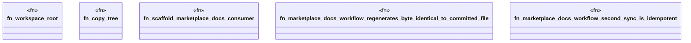

# `crates/ggen-engine/tests/ggen_release_pack_workflow_e2e.rs`

Source SHA-256: `7240b81b66a7403dee9c7704a11625551319445a0f0d978809b82b68c5635d37`

## Dependencies

- `chicago_tdd_tools::cli_proof::CliHarness`
- `std::path::{Path, PathBuf}`
- `tempfile::TempDir`

## Standing

- Structural parse: `ALIVE`
- Runtime behavior: `UNKNOWN`
