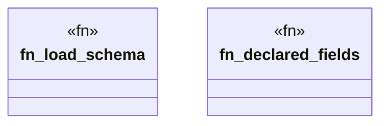

# `crates/ggen-engine/tests/ggen_toml_schema_match.rs`

Source SHA-256: `56abe28dee9219e69a14005798373882d99046da75ceb7e750ece50fe5c91d07`

## Dependencies

- `ggen_engine::{ config::{GgenConfig, Ontology, PackRef, Project, Templates}, graph::DeterministicGraph, }`
- `oxigraph::sparql::QueryResults`
- `schemars::schema_for`
- `serde_json::Value as Json`
- `std::collections::BTreeSet`

## Standing

- Structural parse: `ALIVE`
- Runtime behavior: `UNKNOWN`
