# `crates/ggen-engine/tests/ggen_toml_semantic_validation.rs`

Source SHA-256: `b3ef4b9e887763c0d53b9db27ff9d23607cf8c79b8f0e15613e324180b49e4a9`

```mermaid
classDiagram
    class fn_valid_document_loads {
      <<fn>>
    }
    class fn_empty_project_name_is_rejected {
      <<fn>>
    }
    class fn_ontology_source_path_traversal_is_rejected {
      <<fn>>
    }
    class fn_templates_dir_path_traversal_is_rejected {
      <<fn>>
    }
    class fn_pack_path_traversal_to_sibling_directory_is_allowed {
      <<fn>>
    }
    class fn_pack_path_empty_is_rejected {
      <<fn>>
    }
    class fn_pack_git_empty_version_is_rejected {
      <<fn>>
    }
```

## Dependencies

- `ggen_engine::config::GgenConfig`

## Standing

- Structural parse: `ALIVE`
- Runtime behavior: `UNKNOWN`
