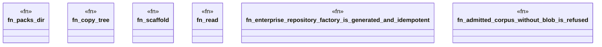

# `crates/ggen-engine/tests/gh_enterprise_architecture_pack_e2e.rs`

Source SHA-256: `f47c129e4980a82ab602a812ee7171c15aabbc06680a7d99e87fb027dda4339c`

## Dependencies

- `ggen_engine::sync::{sync, SyncOptions}`
- `std::path::{Path, PathBuf}`
- `std::process::Command`
- `tempfile::TempDir`

## Standing

- Structural parse: `ALIVE`
- Runtime behavior: `UNKNOWN`
