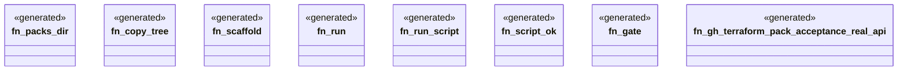

# `crates/ggen-engine/tests/gh_terraform_acceptance_e2e.rs`

Source SHA-256: `94cffeff7c872d8bc5394879977fdc54050a31e46972e7fef9efce3919ab8ea0`

## Dependencies

- `ggen_engine::sync::{sync, SyncOptions}`
- `std::path::{Path, PathBuf}`
- `std::process::Command`
- `tempfile::TempDir`

## Standing

- Structural parse: `ALIVE`
- Runtime behavior: `UNKNOWN`
