# `crates/ggen-engine/tests/gh_terraform_pack_e2e.rs`

Source SHA-256: `e4f7f2ec9bb72bbad5e08470a0b91e3bb0247b1ca1d08173553cbf7769f0231b`

```mermaid
classDiagram
    class fn_packs_dir {
      <<fn>>
    }
    class fn_copy_tree {
      <<fn>>
    }
    class fn_scaffold {
      <<fn>>
    }
    class fn_read {
      <<fn>>
    }
    class fn_count_md_files {
      <<fn>>
    }
    class fn_gh_terraform_pack_generates_full_surface_and_is_idempotent {
      <<fn>>
    }
    class fn_gh_terraform_accept_receipt_chains_hermetically {
      <<fn>>
    }
    class fn_fleet_model_doc_renders_and_exemplar_passes_gates {
      <<fn>>
    }
    class fn_fleet_gate_refuses_unpermitted_override_tierless_repo_and_unadmitted_deviation {
      <<fn>>
    }
    class fn_fleet_census_script_is_read_only_and_outputs_are_committed {
      <<fn>>
    }
```

## Dependencies

- `ggen_engine::sync::{sync, SyncOptions}`
- `std::os::unix::fs::PermissionsExt`
- `std::path::{Path, PathBuf}`
- `std::process::Command`
- `tempfile::TempDir`

## Standing

- Structural parse: `ALIVE`
- Runtime behavior: `UNKNOWN`
