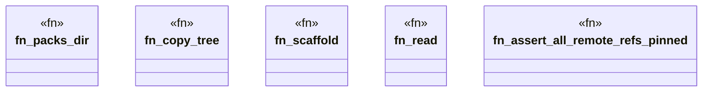

# `crates/ggen-engine/tests/github_actions_pack_e2e.rs`

Source SHA-256: `8f73f027ff02b38de04a180f1d287064c5230fcb3fc33f8b9408dd96bc1ea5fd`

## Dependencies

- `ggen_engine::sync::{sync, SyncOptions}`
- `std::path::{Path, PathBuf}`
- `tempfile::TempDir`

## Standing

- Structural parse: `ALIVE`
- Runtime behavior: `UNKNOWN`
