# `crates/ggen-engine/tests/graph_config_test.rs`

Source SHA-256: `287ee81f41e05f92061dcf99e069d9a1b76680d56815f624f64553e2918e512b`

```mermaid
classDiagram
    class fn_state_hash_deterministic_under_insertion_order {
      <<fn>>
    }
    class fn_state_hash_deterministic_under_incremental_insertion_order {
      <<fn>>
    }
    class fn_blank_node_graphs_hash_equal_under_renaming {
      <<fn>>
    }
    class fn_delta_compute_apply_round_trip_restores_target_hash {
      <<fn>>
    }
    class fn_query_returns_solutions_from_real_store {
      <<fn>>
    }
    class fn_config_parses_valid_ggen_toml_from_real_file {
      <<fn>>
    }
    class fn_config_unknown_key_is_rejected {
      <<fn>>
    }
    class fn_config_missing_file_fails_closed {
      <<fn>>
    }
```

## Dependencies

- `ggen_engine::config::{GgenConfig, PackRef}`
- `ggen_engine::graph::{Delta, DeterministicGraph}`

## Standing

- Structural parse: `ALIVE`
- Runtime behavior: `UNKNOWN`
