# `crates/ggen-engine/tests/graphlaw_e2e.rs`

Source SHA-256: `f5eb2592d713320ad5ac189f079b0bd4e0666c55aedb0c70d2b2605dc0864371`

```mermaid
classDiagram
    class fn_scaffold {
      <<fn>>
    }
    class fn_when_guard_passes_only_after_n3_materialization {
      <<fn>>
    }
    class fn_engines_agree_when_no_law_configured {
      <<fn>>
    }
    class fn_law_gate_violation_refuses_sync_naming_offending_node {
      <<fn>>
    }
    class fn_legacy_law_shapes_is_refused_loudly {
      <<fn>>
    }
    class fn_denial_violation_refuses_sync {
      <<fn>>
    }
    class fn_two_runs_same_fixture_same_graph_hash_and_valid_chain {
      <<fn>>
    }
```

## Dependencies

- `ggen_engine::sync::{sync, EngineKind, SyncOptions, SyncReceipt, RECEIPT_REL_PATH}`
- `std::path::Path`
- `tempfile::TempDir`

## Standing

- Structural parse: `ALIVE`
- Runtime behavior: `UNKNOWN`
