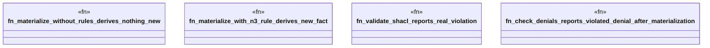

# `crates/ggen-engine/tests/law_engine_test.rs`

Source SHA-256: `b04933a5d648dadd30f4ac2f03be301d8698062c8a59bf51d55098e5c07c219a`

## Dependencies

- `ggen_engine::law_engine::{GraphLawEngine, LawEngine}`

## Standing

- Structural parse: `ALIVE`
- Runtime behavior: `UNKNOWN`
