# `crates/ggen-engine/tests/lint_validate_e2e.rs`

Source SHA-256: `0d7c8be27b9691de1b2d7924c438beb34371ce42564f5aa6a2f0f9ee47c3f769`

```mermaid
classDiagram
    class fn_scaffold {
      <<fn>>
    }
    class fn_parse_file {
      <<fn>>
    }
    class fn_unbound_body_var_on_disk_yields_fm_tpl_003 {
      <<fn>>
    }
    class fn_unbound_to_path_var_on_disk_yields_fm_tpl_004 {
      <<fn>>
    }
    class fn_select_star_disables_projection_check {
      <<fn>>
    }
    class fn_identity_construct_on_disk_yields_fm_tpl_005 {
      <<fn>>
    }
    class fn_graph_validate_files_two_good_pass {
      <<fn>>
    }
    class fn_graph_validate_files_one_malformed_fails_named {
      <<fn>>
    }
    class fn_graph_validate_empty_files_is_project_mode {
      <<fn>>
    }
    class fn_packs_dir {
      <<fn>>
    }
    class fn_write_toolevent_shapes {
      <<fn>>
    }
    class fn_graph_validate_files_with_shapes_conforms {
      <<fn>>
    }
    class fn_graph_validate_files_with_shapes_violation_fails_named {
      <<fn>>
    }
    class fn_graph_validate_refuses_the_iri_collision_fixture_via_max_count {
      <<fn>>
    }
```

## Dependencies

- `camino::Utf8PathBuf`
- `ggen_engine::lint::lint_template`
- `ggen_engine::template::Template`
- `ggen_engine::verbs::handlers::handle_graph_validate`
- `std::path::Path`
- `tempfile::TempDir`

## Standing

- Structural parse: `ALIVE`
- Runtime behavior: `UNKNOWN`
