# `crates/ggen-engine/tests/manifest_diagnostic_codes_evidence_test.rs`

Source SHA-256: `95078b4217008cde9d405af549dc2424767bdca95fa18a061357fd25b9e3eaa7`

```mermaid
classDiagram
    class fn_write_manifest {
      <<fn>>
    }
    class fn_unordered_inline_select_under_strict_mode_now_blocks_sync_run {
      <<fn>>
    }
    class fn_ordered_inline_select_under_strict_mode_syncs_cleanly {
      <<fn>>
    }
    class fn_unordered_construct_under_strict_mode_now_blocks_sync_run {
      <<fn>>
    }
    class fn_ordered_construct_under_strict_mode_syncs_cleanly {
      <<fn>>
    }
    class fn_structurally_invalid_generation_rule_still_fails_sync {
      <<fn>>
    }
```

## Dependencies

- `ggen_engine::sync::{sync, SyncOptions}`
- `std::path::Path`
- `tempfile::TempDir`

## Standing

- Structural parse: `ALIVE`
- Runtime behavior: `UNKNOWN`
