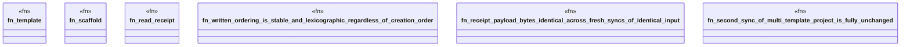

# `crates/ggen-engine/tests/multi_template_determinism.rs`

Source SHA-256: `8ee6b85c73e40609af234337b11c0412b4f553c929f5681015fe9ee73c5989fd`

## Dependencies

- `ggen_engine::sync::{sync, SyncOptions, SyncReceipt, RECEIPT_REL_PATH}`
- `std::path::{Path, PathBuf}`
- `tempfile::TempDir`

## Standing

- Structural parse: `ALIVE`
- Runtime behavior: `UNKNOWN`
