# `crates/ggen-engine/tests/pack_behaviors_cli_e2e.rs`

Source SHA-256: `946c6f3afe18494e869d19b414ba54aecd376bf50629e35e1f3c289fcd0ec496`

```mermaid
classDiagram
    class fn_examples_dir {
      <<fn>>
    }
    class fn_copy_tree {
      <<fn>>
    }
    class fn_scaffold {
      <<fn>>
    }
    class fn_write_pack {
      <<fn>>
    }
    class fn_write_two_pack_project {
      <<fn>>
    }
    class fn_git {
      <<fn>>
    }
    class fn_make_git_pack_source {
      <<fn>>
    }
    class fn_dry_run_never_writes_or_mutates_lock_over_the_cli_boundary {
      <<fn>>
    }
    class fn_two_packs_colliding_output_aborts_sync_over_the_cli_boundary {
      <<fn>>
    }
    class fn_git_resolved_pack_syncs_over_the_cli_boundary_and_caches_across_runs {
      <<fn>>
    }
```

## Dependencies

- `chicago_tdd_tools::cli_proof::CliHarness`
- `std::path::{Path, PathBuf}`
- `tempfile::TempDir`

## Standing

- Structural parse: `ALIVE`
- Runtime behavior: `UNKNOWN`
