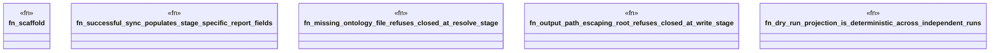

# `crates/ggen-engine/tests/pipeline_stage_evidence_test.rs`

Source SHA-256: `cea82495b9bea67c40d1bf377f84e34894fe15db441ea2651130a6359b7e819b`

## Dependencies

- `ggen_engine::sync::{sync, SyncOptions}`
- `std::path::Path`
- `tempfile::TempDir`

## Standing

- Structural parse: `ALIVE`
- Runtime behavior: `UNKNOWN`
