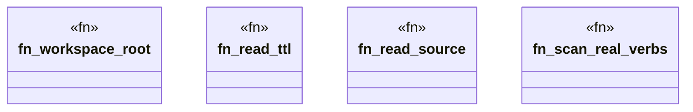

# `crates/ggen-engine/tests/product_mirror_conformance.rs`

Source SHA-256: `1c81053b67ea2f52748a6b01d8b453ef18db9fe351c9813c56e6a7c8e2bd4d3a`

## Dependencies

- `ggen_engine::graph::DeterministicGraph`
- `oxigraph::sparql::QueryResults`
- `std::collections::BTreeSet`
- `std::path::{Path, PathBuf}`

## Standing

- Structural parse: `ALIVE`
- Runtime behavior: `UNKNOWN`
