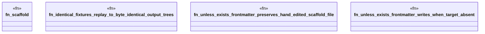

# `crates/ggen-engine/tests/projection_determinism_test.rs`

Source SHA-256: `52067587a5f03d83a24987b93e1e11d8d10da76a86afbce83eb8c546cd79e643`

## Dependencies

- `ggen_engine::sync::{sync, SyncOptions}`
- `std::path::Path`
- `tempfile::TempDir`

## Standing

- Structural parse: `ALIVE`
- Runtime behavior: `UNKNOWN`
