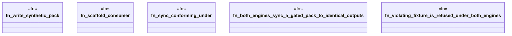

# `crates/ggen-engine/tests/reasoner_independence_e2e.rs`

Source SHA-256: `6debfc3f79830d5b85352c388650c93184286f7da6bda1f3117e7a13636a8e99`

## Dependencies

- `ggen_engine::sync::{sync, EngineKind, SyncOptions}`
- `std::path::{Path, PathBuf}`
- `tempfile::TempDir`

## Standing

- Structural parse: `ALIVE`
- Runtime behavior: `UNKNOWN`
