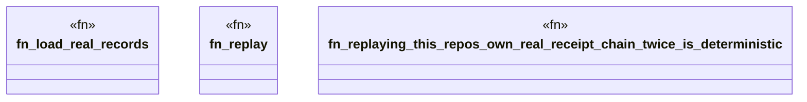

# `crates/ggen-engine/tests/receipt_chain_own_history_replay.rs`

Source SHA-256: `6c2039079b4768be3f45cf185090dcb4cd69497225405f4e6900a07df2488b95`

## Dependencies

- `praxis_core::receipt_epoch::{read_receipt_epoch, AndonLevel, CeilingLevel, MigrationReceipt}`
- `praxis_core::receipt_record::ReceiptRecord`
- `serde_json::Value`
- `std::fs`
- `std::path::Path`

## Standing

- Structural parse: `ALIVE`
- Runtime behavior: `UNKNOWN`
