# `crates/ggen-engine/tests/receipt_signing_evidence_test.rs`

Source SHA-256: `90b8be029d3c44abdd8bffbdcb2e5e9b9f81f572db41067de37dfdaa07f2140a`

```mermaid
classDiagram
    class fn_scaffold {
      <<fn>>
    }
    class fn_write_ontology {
      <<fn>>
    }
    class fn_read_receipt {
      <<fn>>
    }
    class fn_second_sync_prev_chain_hash_equals_first_sync_chain_hash {
      <<fn>>
    }
    class fn_receipt_verify_passes_on_genuine_untampered_receipt {
      <<fn>>
    }
    class fn_receipt_verify_fails_closed_on_tampered_payload_hash {
      <<fn>>
    }
    class fn_receipt_verify_refuses_unsupported_schema_version {
      <<fn>>
    }
```

## Dependencies

- `chicago_tdd_tools::cli_proof::CliHarness`
- `ggen_engine::sync::{sync, SyncOptions, SyncReceipt, RECEIPT_REL_PATH}`
- `std::path::Path`
- `tempfile::TempDir`

## Standing

- Structural parse: `ALIVE`
- Runtime behavior: `UNKNOWN`
