# `crates/ggen-engine/tests/reflexive_law_e2e.rs`

Source SHA-256: `627097e0641a48f0480b5d25d0e46301057773bace9aba527fceef652e60b77b`

```mermaid
classDiagram
    class fn_write_synthetic_pack {
      <<fn>>
    }
    class fn_scaffold_synthetic_consumer {
      <<fn>>
    }
    class fn_write_flag_template {
      <<fn>>
    }
    class fn_hooks_live_and_are_queryable_by_templates {
      <<fn>>
    }
    class fn_hook_derived_facts_are_gate_checked {
      <<fn>>
    }
    class fn_reflexive_receipts_second_sync_sees_first {
      <<fn>>
    }
    class fn_reflexive_off_by_default_is_unaffected {
      <<fn>>
    }
    class fn_malformed_receipt_log_line_is_skipped_not_fatal {
      <<fn>>
    }
```

## Dependencies

- `chicago_tdd_tools::cli_proof::CliHarness`
- `std::path::{Path, PathBuf}`
- `tempfile::TempDir`

## Standing

- Structural parse: `ALIVE`
- Runtime behavior: `UNKNOWN`
