# `crates/ggen-engine/tests/sparql_feature_coverage_e2e.rs`

Source SHA-256: `935f5fea68436f6b0925c7d5dabc5e068f83d3cda822f0657d0710ad3b5fa1d2`

```mermaid
classDiagram
    class fn_scaffold {
      <<fn>>
    }
    class fn_write_template {
      <<fn>>
    }
    class fn_run_sync {
      <<fn>>
    }
    class fn_optional_unbound_variable_across_heterogeneous_rows_with_guarded_access {
      <<fn>>
    }
    class fn_optional_unguarded_access_to_missing_key_behavior_is_documented_by_a_real_run {
      <<fn>>
    }
    class fn_group_by_count_aggregate_comes_through_as_a_real_number_after_task1_coercion {
      <<fn>>
    }
    class fn_filter_clause_restricts_result_set {
      <<fn>>
    }
    class fn_union_clause_combines_alternative_patterns {
      <<fn>>
    }
    class fn_describe_query_returns_a_non_empty_triple_array {
      <<fn>>
    }
```

## Dependencies

- `ggen_engine::sync::{sync, SyncOptions}`
- `std::path::Path`
- `tempfile::TempDir`

## Standing

- Structural parse: `ALIVE`
- Runtime behavior: `UNKNOWN`
