# `crates/ggen-engine/tests/sparql_refusals_e2e.rs`

Source SHA-256: `437423a6a09ff77c8dbb35b09973c03861d4023a315d6fe1459aa9e9b095e8de`

```mermaid
classDiagram
    class fn_scaffold {
      <<fn>>
    }
    class fn_write_template {
      <<fn>>
    }
    class fn_graph_clause_is_refused_loudly_not_silently_empty {
      <<fn>>
    }
    class fn_graph_clause_nested_inside_filter_exists_is_also_refused {
      <<fn>>
    }
    class fn_query_with_graph_substring_inside_a_string_literal_is_not_a_false_positive {
      <<fn>>
    }
    class fn_sparql_update_attempt_is_refused_with_a_clear_named_message {
      <<fn>>
    }
    class fn_sparql_delete_update_attempt_is_also_refused_with_a_clear_message {
      <<fn>>
    }
    class fn_service_clause_fails_closed_with_a_clear_evaluation_error {
      <<fn>>
    }
```

## Dependencies

- `ggen_engine::sync::{sync, SyncOptions}`
- `std::path::Path`
- `tempfile::TempDir`

## Standing

- Structural parse: `ALIVE`
- Runtime behavior: `UNKNOWN`
