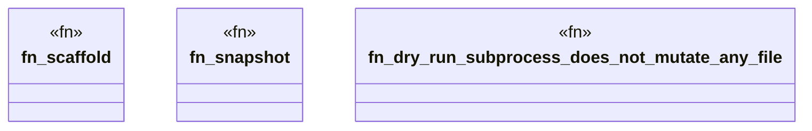

# `crates/ggen-engine/tests/sync_dry_run_no_mutation_e2e.rs`

Source SHA-256: `55c48f87cd90a1665788c7a134049b091434afaa5c20ff5364ebc6da898a0f8b`

## Dependencies

- `std::{ path::Path, time::{Duration, SystemTime}, }`
- `tempfile::TempDir`

## Standing

- Structural parse: `ALIVE`
- Runtime behavior: `UNKNOWN`
