# `crates/ggen-engine/tests/sync_e2e.rs`

Source SHA-256: `50c450a9980545bbc9bec1c8597a51a6e2ead790adcac1348e26ebbfffb31b5a`

```mermaid
classDiagram
    class fn_scaffold {
      <<fn>>
    }
    class fn_first_sync_writes_second_sync_skips_unchanged_and_hash_is_stable {
      <<fn>>
    }
    class fn_dry_run_writes_nothing {
      <<fn>>
    }
    class fn_non_dry_sync_emits_verifiable_receipt {
      <<fn>>
    }
    class fn_missing_ggen_toml_fails_closed {
      <<fn>>
    }
    class fn_render_failure_names_available_context_keys {
      <<fn>>
    }
    class fn_when_guard_that_is_not_an_ask_query_is_refused_with_fm_tpl_016 {
      <<fn>>
    }
    class fn_oversized_rendered_output_is_refused {
      <<fn>>
    }
    class fn_a_render_failure_leaves_no_writes_from_other_templates_in_the_same_run {
      <<fn>>
    }
    class fn_duplicate_render_targets_are_refused {
      <<fn>>
    }
    class fn_nondeterministic_to_path_violates_determinism_check {
      <<fn>>
    }
    class fn_dry_run_refuses_non_utf8_existing_target {
      <<fn>>
    }
```

## Dependencies

- `ggen_engine::sync::{sync, SyncOptions, SyncReceipt, RECEIPT_REL_PATH}`
- `std::path::Path`
- `tempfile::TempDir`

## Standing

- Structural parse: `ALIVE`
- Runtime behavior: `UNKNOWN`
